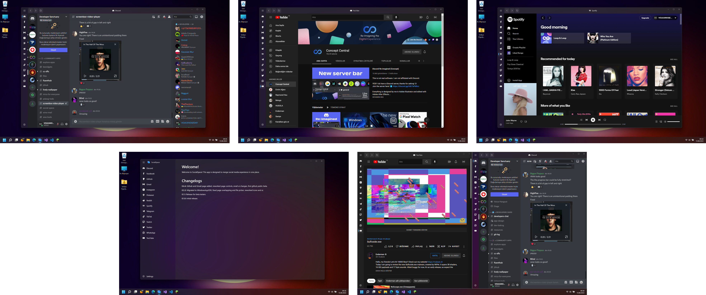

# SocialSpace
SocialSpace is an app designed to merge social media experience in one place. There might be bugs as it's currently under development.  

## Screenshots

## Installation
1- Download SocialSpace-0.6.3.exe from releases section.  
2- Follow the instructions that program gives.  
Note: Sometimes powershell window can open minimized so if you see it's opened, please switch to powershell window and continue to follow the instructions.  

## Changelogs
1.0.0: Initial stable release.  
0.9.x: Public beta, bug fixes.  
0.8.1: Settings page and reordering page controls will be added.  
0.7.1: Minimizing to the tray will be added, Google login will be fixed.  
0.6.4: Github and Gmail page added, reworked page controls, small ui changes, first github public beta.  
0.5.3: Migrated to WindowsAppSDK, fixed page overlapping and file picker, reworked icons and ui.  
0.1.1: Release for beta testers.  
0.1.0: Initial release.  